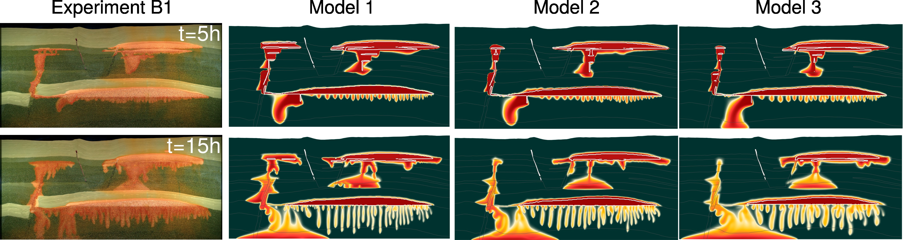
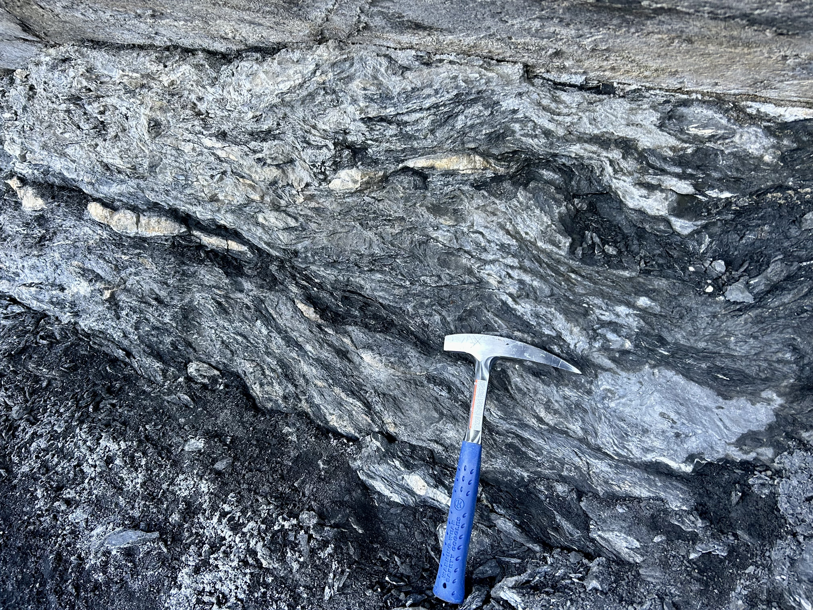
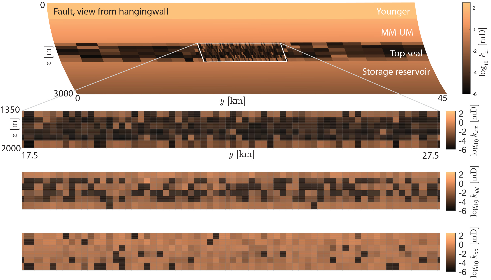
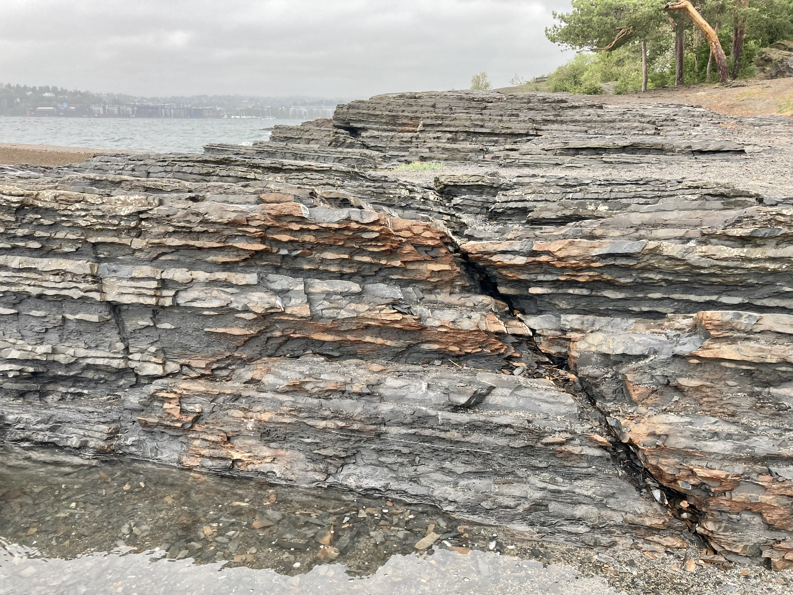
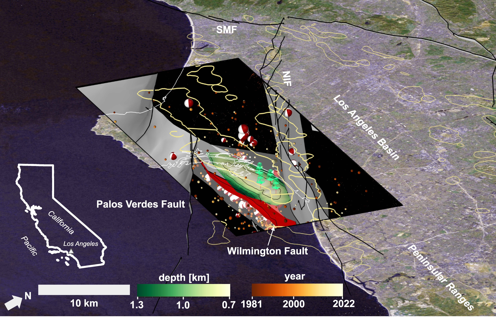

<div class="banner-carousel">
  
  
  
  
</div>

::: {.banner-title}
# [S]{.accent}imulation, [A]{.accent}ssessment, and [L]{.accent}earning of ge[O]{.accent}systems ([SALO]{.accent}) Lab
:::

## About
Our group uses a variety of approaches to simulate, assess, and understand geosystems. In particular, we combine physics-based and data-driven modeling with laboratory experiments to address fundamental and applied research questions at the intersection of geoscience, subsurface energy, and the environment. We are based in the Department of Earth, Environmental, and Planetary Sciences at the University of Tennessee, Knoxville, where we regularly interact with the Department of Civil and Environmental Engineering and the Bredesen Center for Interdisciplinary Research and Graduate Education.

## News
- **Aug 2026** — [Ana María Rincón](https://lluissalo.com/people/ana-rincon) joins the group as a M.S. student (co-advised with Dr. [Anner Paldor](https://eeps.utk.edu/person/anner-paldor/)). Welcome!
- **Jun 2026** — Hannah Lu's [paper](https://doi.org/10.1007/s00477-026-03305-z) accepted in *Stochastic Environmental Research and Risk Assessment*.
- **Jun 2026** — [Rubén Vidal Montes](https://lluissalo.com/people/ruben-vidal) joins the group as a Postdoctoral Researcher. Welcome!
- **Mar 2026** — [L. T. Ozgur Yildirim](https://lluissalo.com/people/ozgur-yildirim) joins the group as a Postdoctoral Researcher. Welcome!
<!-- - **Jan 2026** — Lluís joins UTK as the Barbara McDonald Assistant Professor in Energy Transition. {.news-img} -->

## Research Directions

::: {.grid}

::: {.g-col-4}
::: {.card}
{.card-img-top}

### Fault Zone Characterization & Modeling
Development of new tools to study fault zone evolution and improve their characterization in numerical models.

[Learn more →](research.qmd)
:::
:::

::: {.g-col-4}
::: {.card}
```{=html}
<div class="card-video">
<iframe src="https://www.youtube.com/embed/xnWL8WcfzsI?si=cWL7FT36gfz_b11T" frameborder="0" allowfullscreen></iframe>
</div>
```

### Geologic Carbon Dioxide Sequestration (GCS)
Mitigation of environmental risks associated with GCS, with particular emphasis on fluid migration through faults.

[Learn more →](research.qmd)
:::
:::

::: {.g-col-4}
::: {.card}
{.card-img-top}

### Geohazards in Subsurface Energy Systems
Multiphysics modeling of fault stability and development of risk assessment workflows for subsurface operations.

[Learn more →](research.qmd)
:::
:::

:::
