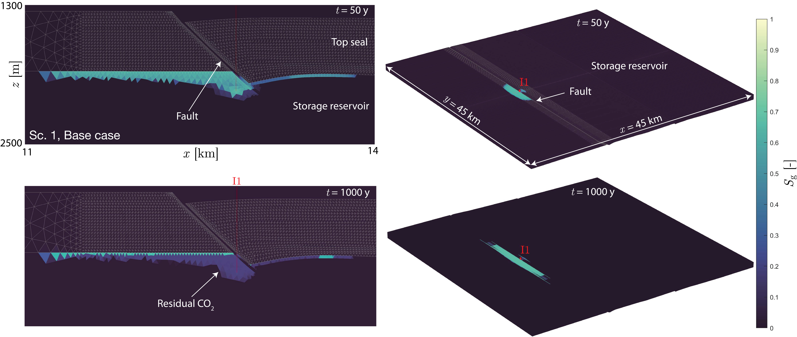
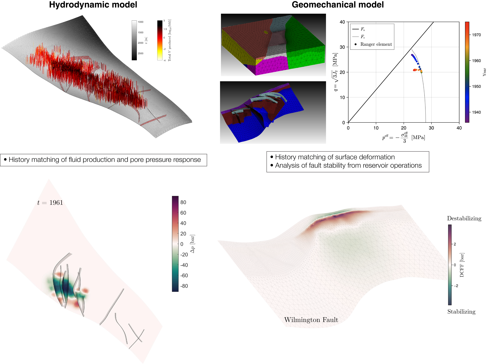

Our group develops computational and experimental tools to simulate, assess, and understand geosystems. We combine physics-based and data-driven modeling with laboratory experiments to address fundamental and applied research questions at the intersection of geoscience, subsurface energy, and the environment.

::: {.research-card-wide}
::: {.grid}
::: {.g-col-7}
```{=html}
<a href="research/faults.qmd">
  
</a>
```
:::
::: {.g-col-5}
### [Fault Zone Characterization & Modeling](research/faults.qmd)

Faults are ubiquitous geologic discontinuities that exert a first-order control on subsurface fluid flow, yet their hydraulic and mechanical properties remain poorly constrained. Our group develops stochastic and physics-based frameworks to model fault zone architecture and its impact on hydraulic properties, combining outcrop observations, subsurface data, and numerical modeling.

[Read more →](research/faults.qmd)
:::
:::
:::

::: {.research-card-wide}
::: {.grid}
::: {.g-col-7}
[](research/co2-storage.qmd)
:::
::: {.g-col-5}
### [Geologic CO$_2$ Storage](research/co2-storage.qmd)

Geologic carbon dioxide storage is a key technology for climate change mitigation, but its large-scale deployment requires thorough understanding of subsurface risks. Our group models CO$_2$ migration in faulted formations, validates simulations against laboratory and field data, and assesses storage capacity and containment at scales relevant for climate impact.

[Read more →](research/co2-storage.qmd)
:::
:::
:::

::: {.research-card-wide}
::: {.grid}
::: {.g-col-7}
[](research/induced-seismicity.qmd)
:::
::: {.g-col-5}
### [Geohazards in Subsurface Energy Systems](research/induced-seismicity.qmd)
Subsurface energy operations involve the injection and/or withdrawal of fluids from the subsurface. These operations change the effective stress in the reservoir and surrounding formations, and can drive a range of geohazards, including fault reactivation and induced seismicity. Our group uses modeling tools that couple subsurface physics to investigate these hazards and develop risk assessment workflows.

[Read more →](research/induced-seismicity.qmd)
:::
:::
:::


### Sponsors

We gratefully acknowledge the support of our research sponsors, without whom our research would not be possible.

<div class="sponsor-logos">
  <a href="https://corporate.exxonmobil.com" target="_blank" style="margin-right: 1rem;">
    
  </a>
  <a href="https://www.conservation.ca.gov" target="_blank">
    
  </a>
</div>