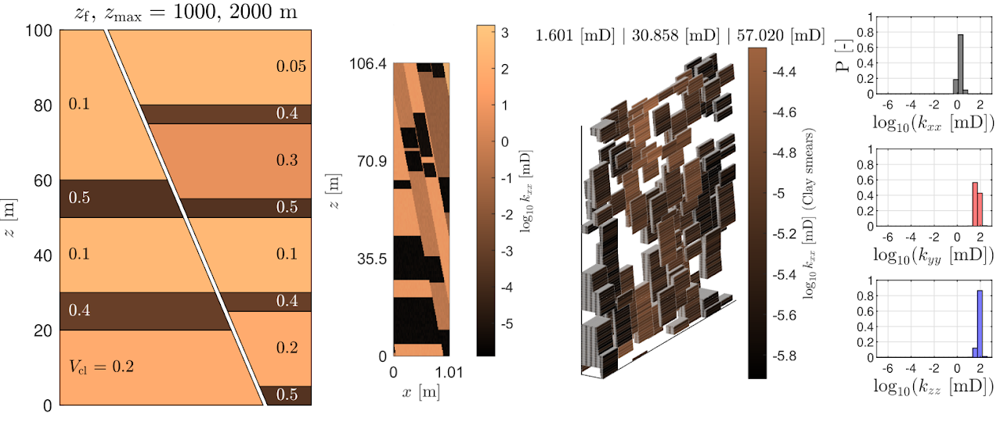

Our group develops computational and experimental tools to simulate, assess, and understand geosystems. We combine physics-based and data-driven modeling with laboratory experiments to address fundamental and applied research questions at the intersection of geoscience, subsurface energy, and the environment.

::: {.research-card-wide}
::: {.grid}
::: {.g-col-6}
[](research/faults.qmd)
:::
::: {.g-col-6}
### [Fault Zone Characterization & Modeling](research/faults.qmd)
Stochastic modeling of fault zone architecture, clay smear prediction, and experimental characterization of fault rock hydraulic and mechanical properties.
:::
:::
:::

::: {.research-card-wide}
::: {.grid}
::: {.g-col-6}
[](research/intermediate-experiments.qmd)
:::
::: {.g-col-6}
### [Intermediate-Scale Experiments in Faulted Settings](research/intermediate-experiments.qmd)
Laboratory experiments in porous media, including CO$_2$ injection in faulted geometries and sandbox models of faulting and fluid flow.
:::
:::
:::

::: {.research-card-wide}
::: {.grid}
::: {.g-col-6}
[](research/induced-seismicity.qmd)
:::
::: {.g-col-6}
### [Fault-related Hazards in Subsurface Energy](research/induced-seismicity.qmd)
Multiphysics modeling of injection-induced earthquakes and development of risk assessment workflows for subsurface operations.
:::
:::
:::

::: {.research-card-wide}
::: {.grid}
::: {.g-col-6}
[](research/co2-faults.qmd)
:::
::: {.g-col-6}
### [CO$_2$ Storage](research/co2-faults.qmd)
Understanding and modeling fault-related CO$_2$ migration risk during and after geologic carbon storage, from individual faults to field-scale assessments.
:::
:::
:::

::: {.research-card-wide}
::: {.grid}
::: {.g-col-6}
[](research/hydrogen-storage.qmd)
:::
::: {.g-col-6}
### [Hydrogen Storage](research/hydrogen-storage.qmd)
Evaluating feasibility and risks of underground hydrogen storage in depleted reservoirs, including pore pressure evolution and fault stability.
:::
:::
:::

::: {.research-card-wide}
::: {.grid}
::: {.g-col-6}
[](research/natural-hazards.qmd)
:::
::: {.g-col-6}
### [Natural Hazards & Seismology](research/natural-hazards.qmd)
Environmental seismology & rockfalls.
:::
:::
:::

### Sponsors

We gratefully acknowledge the support of our research sponsors, without whom our research would not be possible.

```{=html}
<div class="sponsor-logos">
  <a href="https://corporate.exxonmobil.com" target="_blank">
    
  </a>
  <a href="https://www.conservation.ca.gov" target="_blank">
    
  </a>
</div>
```